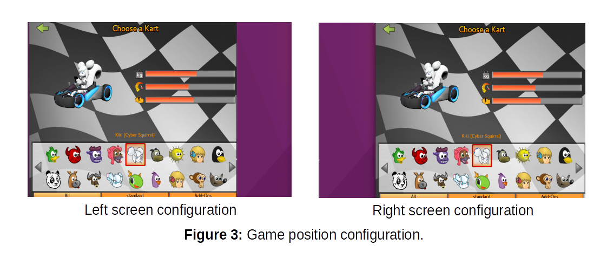

# Self-KartDriving
This project was developed as result of the 2018 pythonscholarsip. Here, a pre-trained model was fine-tuned to learn to self-drive in the SuperTuxKart game.

# Requirements:
To train and running this project, you can use Anaconda 64-Bit with python 3.7. Then, create a virtual environment and install the following:

* pillow=5.3.0
* numpy=1.15.4
* pytorch-cpu=0.4.1
* torchvision-cpu=0.2.1
* mss=3.3.2
* pynput=1.4

Note that this project was only tested with Ubuntu 16.04 LTS. Therefore it may not work with other systems.

# Model Architecture:
The model is composed by an alexnet model, which was fine-tuned. The model receives an input with shape: 224 x 224 x 3, where the two first elements represent the width and hight, and the last one, the number of channels. Also, the last part of the original model has been replaced with a set of fully connected layers. A representation of the model can be visualized in the figure below:


To avoid overfitting, a set of dropout layers were applied to the fully connected section of the model, with a probability of 70%. There was a total of five defined classes, four of them represent the basic actions that the model can take on the game, this actions are: turn to the left, turn to the right, accelerate and return. The last class indicates when the race is over, and is used to stop the main script. These classes can be visualized in the figure below:


# Training:
In order to train the model, a set of images with different time intervals where extracted from a gameplay video of the __CandelaCity__ track. Then, each image was labeled accordingly with their respective classes. These are stored in a folder called dataset.

To train this model from scratch, you have two options: 
* Download the dataset from <a href="https://drive.google.com/open?id=1W7DgjqPx3PZkEdPDnsxzkKieilURbwv0" target="_blank">here</a>. Once download, unzip it in the same level as the script folder. You must now have a folder called dataset with a folder inside called train. To add more data, you need to capture it from video/images. Here you can use PIL, or another library, just make sure you to capture the images without the top part (as shown in the __Figure 2__).
* Generate your own data. In this case, you can choose the image ratio which you like. However, you must gather all the data from zero.

In both cases, make sure the model is getting the right image. To check that, go the the ```run.py``` file and modify the values from the mss screenshot until you get an adequate image:
```
# Modify these values if they do not fit your screen.
if screen == 'r':
  # take a right screenshot
  monitor = {"top": 145, "left": 342, "width": 1018, "height": 620}
elif screen == 'l':
  # take a left screenshot
  monitor = {"top": 145, "left": 70, "width": 1018, "height": 620}
````
Now, you can use the ```training.py``` file. It would require to input the number of epochs to train (make sure you have enough free space in your hard drive). Also, the model is defined in the ```model_helper.py``` file. There you can change the model’s parameters like:  batch size, learning rate, optimizer, etc.

You can also check the model(s) performance with the ```eval_model.py``` file. Finally, you can display a plot of the loss of the entire training with the ```plot.py``` file.

Here is an example of using all the training scripts:
<p align="center">
<a href="https://youtu.be/Vl6mrSCoWhg" target="_blank">
  
</a>
</p>

# Running:
## Initial game configuration
__This step need to be done only once__. First, make sure you have installed SuperTuxKart version 0.9.3. Then, in order to run the project, you need to configure the screen resolution of the game. For that, open the game and go to the options at the bottom of the main screen, then go to Graphics:

*  Deactivate the full screen option.
*  Set the resolution to 1024 x 768 (ratio 4:3).
*  Then click on Apply new resolution.
*  It is recommendable to low the graphics quality. In the same window go to Custom settings and disable the option Advadcend pipeline (lights, etc.), also set the Rendered image quality and geometric detail to Low, then click on Apply.

## Script execution
Before running the script, make sure you have the game already configured as described in the __Initial game configuration section__. Also, you must have a trained model to run. You can download two models from [here](https://drive.google.com/open?id=1QolDRlcU6tqQoWQkLLesQ0gya6DAAx7M). Once downloaded, unzip them on the same level as the script folder. You must have now a folder called models.

Next, open the game and select the single player option. In the kart selection, select Kiki (Cyber Squirrel), if you do not have it, you can installed it in addons > karts > Kiki Cyber Squirrel by 3DMish | From TysonTan’s Images.

Now, on the Race Setup window, select the __Novice__ difficulty, and the __Time Trial__ mode. Next, on the Track window, select the track named: __CandelaCity__. On the next screen set the number of AI karts to 0 and the number of laps as 1.

Go to the script folder, open a terminal and type: ```python run.py```. On the terminal select the game screen position. It could be right or left. You can see an example of each one in the following image:


To select an orientation, type their first letter (r or l), then press enter. Now, insert the number of steps to run, I recommended about 500 for this track.

If you downloaded the models, you must have two available trained models in the list selection. The best results are obtained with the second model (loss ~ 0.26). However, both models have difficulties before reaching the final. To select one, type their number, and press enter.

Now, go to the game, and press star race. Set a number of seconds to wait before start the script. Once done, make sure you have the game as an active window (click on the game), otherwise the model will began to send keys to whatever window is active!

The script will terminate once:
*  The model recognize the game is over or,
*  The maximum number of steps is reached
In any case, to terminate the script manually, simply go back to the terminal and cancel the execution (crtl + c)

# Results:
<p align="center">
<a href="https://youtu.be/3-iMFt9lsOg" target="_blank">
  
</a>
</p>
